# Conditional Access - Location based Data Protection in a Web app
The purpose of this section is to highlight a sample demonstration of the scenario. There may be other configurations/deployment scenarios. The configuration below is simply one illustration. 

This repository has been created to document the sample demonstration deployment instructions for the scenario described in article [Location-based access control for FSI applications - Azure Architecture Center | Microsoft Learn](https://learn.microsoft.com/azure/architecture/example-scenario/financial/location-based-access)

# Summary of the sample scenario:

The diagram below highlights at a high-level, the configuration steps A. and B. performed by the Administrator and Application Developer roles  respectively as well as the end-user steps 1.- 7. to demonstrate the scenario.

   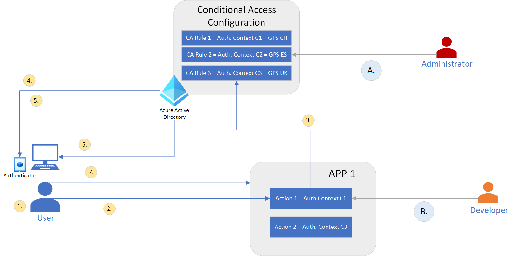

**A.**	Administrator configures Conditional Access policy mapping authentication context to GPS Named Location (One-time activity) E.g. C1 = GPS CH (Switzerland)

**B.**	Application Developers make their Apps Application context aware and can trigger step-up authentication requesting the required claims for actions from within their applications E.g. Action 1 requires Auth. Context claim acrs=C1

**C.** End-User Steps:

1.	User is already authenticated to App 1
2.	User attempts to perform Action 1 withing App 1
3.	Action 1 requires Authentication Context Claim C1 (C1 = location Switzerland) to successfully execute. However since the current token doesn’t have a claim C1 a claims challenge is triggered
4.	Azure AD executed policy CA policy 1 that maps to claim C1 to GPS location and requests location from the users Authenticator App.
5.	User consents appropriately if it’s the first time and provides location information
6.	If the location information matches CH (Switzerland) a new access token is issued by Azure AD with claim C1
7.	Call comes back to App 1 with the new Access token and claim C1 and Action 1 is successfully executed

# Deploy this Scenario

## Pre-requisites

1.	Demo or Trial M365 Tenant
2.	Sample Application and Visual Studio
3.	1 x Tenant Administrator account with appropriate admin rights in the M365 tenant
4.	1 x Test User account in with the appropriate AAD licenses assigned in the M365 Tenant
5.	1 x iOS/Android device supported by Microsoft Authenticator

### Scenario Setup Steps

_**Step 1: Configure Passwordless Phone-Sign with Authenticator**_

> **Note**: Steps 1-3 are not a requirement for enforcing Location. However in order to onboard the user to Authenticator we have chosen the Authentication method Passwordless Phone-Sign-in with Microsoft Authenticator as the Passwordless Strong-Authentication method with Temporary Access Pass (TAP) as the onboarding option.
To enable the authentication method for passwordless phone sign-in, complete the following steps:

To enable the authentication method for passwordless phone sign-in, complete the following steps:
1. Sign in to the Azure portal with an Authentication Policy Administrator account.
2. Search for and select Azure Active Directory, then browse to **Security > Authentication methods > Policies**.
3. Under **Microsoft Authenticator**, choose the following options:
    - **Enable** - Yes
    - **Target** - Select specific Group (Note: Test user must be member of that group)
4. Each added group or user is enabled by default to use Microsoft Authenticator in both passwordless and push notification modes ("Any" mode). To change this, for each row:
    - Browse to ... > **Configure**.
    - For **Authentication mode** - choose **Any** 
5. To apply the new policy, click **Save**.

    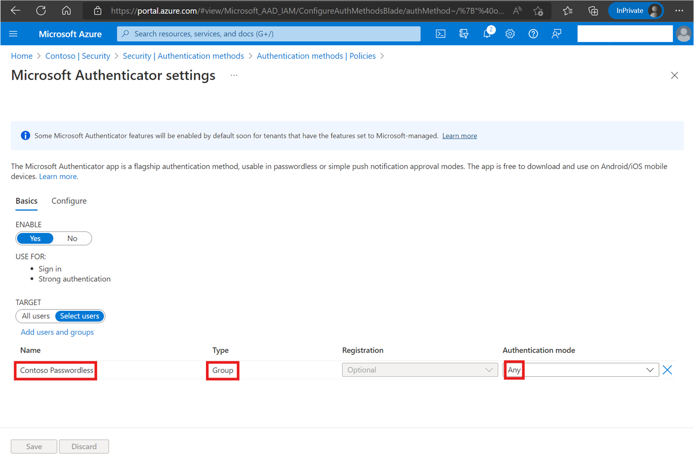

6.	Under **Configure** Tab configure the following
    1. Number matching enabled for Group
    1. Show Application Name enabled for Group
    1. Show geographic location disabled
    1. To apply the new policy, click **Save.**

        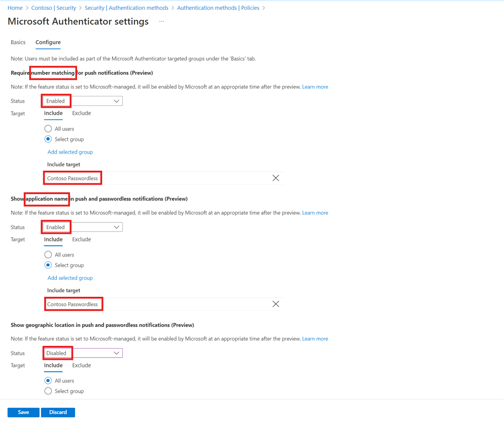

_**Step 2: Configure Temporary Access Pass Settings**_

Assuming users will not have passwords the only way to onboard to Passwordless Phone Sign-in is to use Temporary Access Pass (TAP). The TAP code is a one-time-code generated and communicated to the user.

Please follow the step at link below to Configure a Temporary Access Pass in Azure AD as shown in screenshot:
> [Enable the temporary access pass policy](https://learn.microsoft.com/en-us/azure/active-directory/authentication/howto-authentication-temporary-access-pass#enable-the-temporary-access-pass-policy)

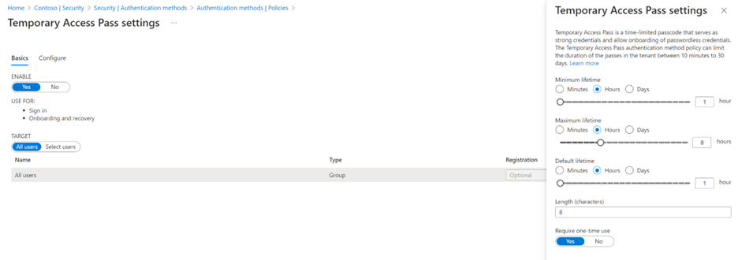

_**Step 3: Onboard the test user to Temporary Access Pass**_

To Onboard the Test User to the Passwordless Phone-Sign-in solution using Temporary Access Pass.

Please logon as Tenant Adminstrator follow the steps in link below to create a new Temporary Access Pass (TAP) code for the Test User account. [Create a Temporary Access Pass](https://learn.microsoft.com/en-us/azure/active-directory/authentication/howto-authentication-temporary-access-pass#create-a-temporary-access-pass)

Thereafter use the Temporary Access Pass (TAP) code to onboard the user on to the Microsoft Authenticator App. To do this:

1. Start the **Microsoft Autheticator App** and Add a new account by selecting **+** sign
2. Choose **Work or school account** and in the "Add work or school account" dialog choose **Sign in**
3. In the **Sign in** dialog enter the **UPN** of the Test User and select **Next**
4. In the "Enter Temporary access pass" page enter the **Temporary Access pass (TAP) Code** that was generate earlier
5. Choose **Continue** in the "Sign-in with your phone" dialog to perform your Device registration
6. Select **Register** to Register your device
7. Choose **Allow** in the "Allow Notification" dialog
8. Select **Finish** 

_**Step 4: Configure GPS Named Locations in Azure AD**_

1. Sign in to the **Azure portal** as a global administrator, security administrator, or Conditional Access administrator. 
2. Browse to **Azure Active Directory > Security > Conditional Access > Named locations.**
3. Choose **New location.**
4. Give your location a name. E.g. *GPS Switzerland*
5. Choose **Select location by GPS coordinates** and choose the country E.g. **Switzerland** from the list by clicking the checkbox.
6. Choose **Save**

    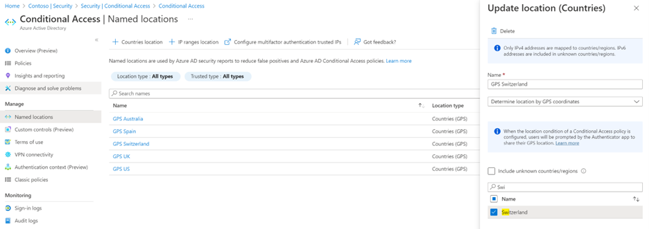

7. Repeat the above steps 3. – 6. and create a few additional GPS country locations E.g. GPS UK, GPS Spain and GPS US

_**Step 5: Configure Authentication Context Claims in Azure AD**_

1. Sign in to the **Azure portal** as a global administrator, security administrator, or Conditional Access administrator.
2. Authentication contexts are managed in the **Azure portal under Azure Active Directory > Security > Conditional Access > Authentication context**
3. Create new authentication context definitions by selecting **New authentication context** in the Azure portal. Provide a Display name, Description, Publish to apps must be selected and the ID is a read-only value of the next available ID which is c1-c25 (At the time of writing the number of authentication context definitions was limited to 25)

    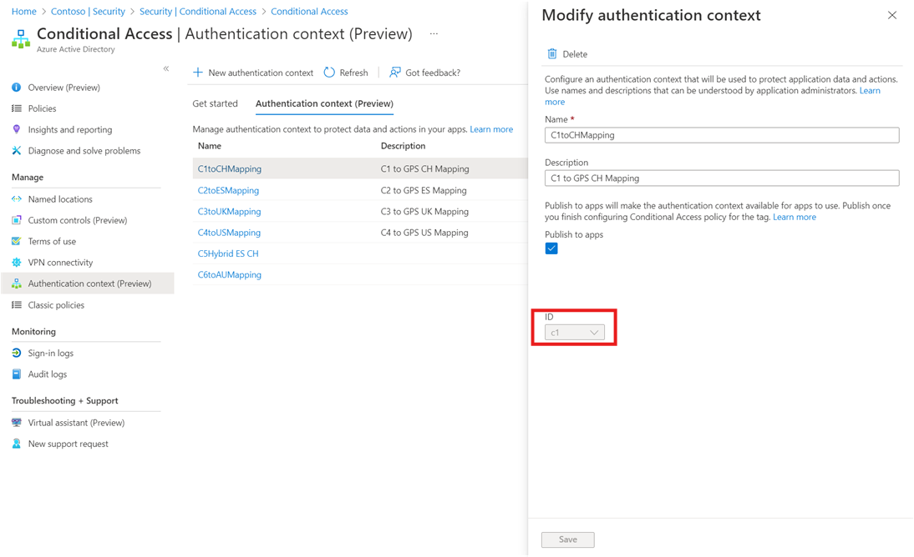

4. Repeat step 3. and create multiple authentication contexts that will be mapped to respective GPS locations

_**Step 6: Configure Conditional Access Policy to map Claims to GPS Named Locations**_

This is where the Conditional Access policy maps the authentication context to the GPS location condition. 

1. Sign in to the **Azure portal** as a global administrator, security administrator, or Conditional Access administrator.
Authentication contexts are managed in the Azure portal under **Azure Active Directory > Security > Conditional Access > Policies**

2.	Create a new Policy with the settings, under **Users or Workload Identities** select **All Users**

3.	Administrators can select published authentication contexts in their Conditional Access policies under **Assignments > Cloud apps or actions** and selecting **Authentication context (preview)** from the **Select what this policy applies to** menu

4.	Under **Select the Authentication Contexts this policy will apply to** Select the appropriate Authentication context we created earlier E.g. C1toCHMapping

    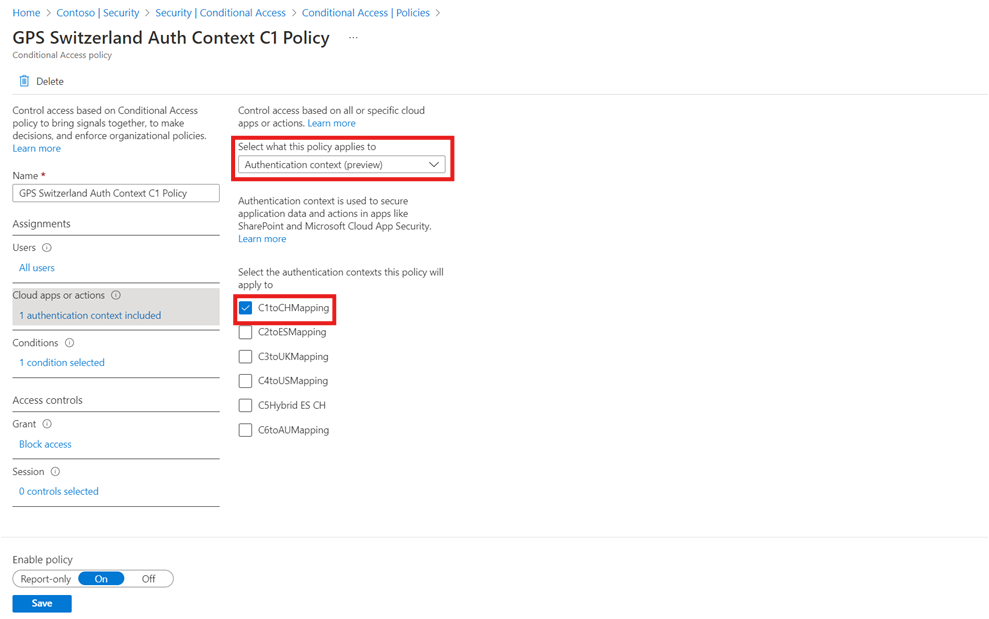

5.	Under **Conditions** configure the location condition **Include** All locations and **Exclude** the named GPS location **E.g. GPS Switzerland**

    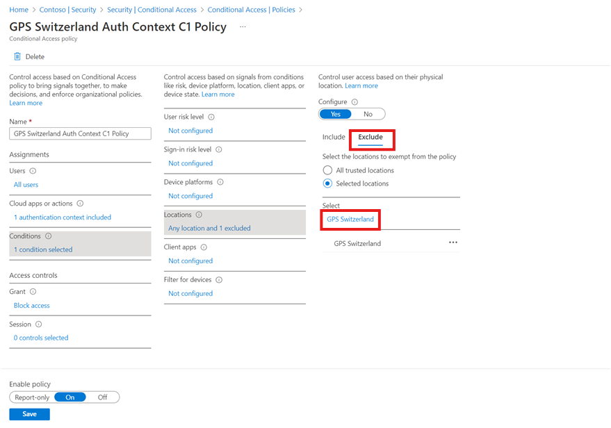

6.	Under **Grant** select **Block access**

7.	Choose **Save**

8.	Repeat steps 2. – 7. and create additional Conditional Access policies for E.g. GPS ES Authentication Context C2, GPS UK Authentication Context C3, GPS US Authentication Context C4

At the end of this step you will have created Policies mapping authentication context to named locations
- C1 – GPS Switzerland
- C2 – GPS Spain
- C3 – GPS UK
- C4 – GPS US

For the purpose of our demo we require the policies/mapping C1 – GPS Switzerland and C3 – GPS UK.

_**Step 7: Deploy Sample Application**_

Deploy the Sample ToDoList application as per the instructions documented at link below:

>**Note:** You do not need to configure the Authentication Contexts and Policy rules described in the sample application instructions since you already performed these steps 4 – 6 earlier.

[Code Sample 1: Use the Conditional Access auth context to perform step-up authentication for high-privilege operations in a web app](https://github.com/Azure-Samples/ms-identity-dotnetcore-ca-auth-context-app/blob/main/README.md)

Once deployed, run the application as per the instructions

_**Step 8: Configure Application to use Authentication Context Claims mapped Location**_

>**Note:** For the purpose of the demo we are using a single Test User account to perform the Application configuration as well as the User testing in the next step. Typically the application configuration step is not exposed and should be pre-configured and automated as part of the Application deployment process.
1.	Once the Sample Application is running, on the same machine Browse to https://localhost:44321 and sign-in with the Test User account 
2.	Sign-in using Passwordless Phone-Sign-in instead of Username/Password
3.	Once logged on to the TodoListClient application Click **Admin** to create mappings between an Application Operations and Conditional Access policy. 
    >Note: This Sample application is exposing two Operation, POST and DELETE

    -   Map the **POST** operation to Authentication Context **C1** requiring the user to be in location _**Switzerland**_ to successfully create a ToDoList item
    - Map the **DELETE** operation to Authentication Context **C3** requiring the user to be in location _**UK**_ to successfully delete a ToDoList item

    Once complete the mappings should show up as below:

    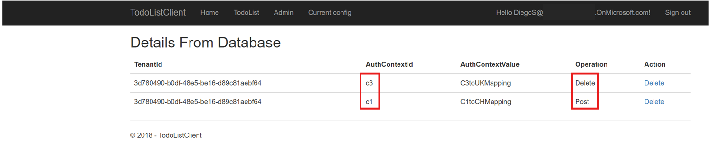

4. **Sign-out** from TodoListClient application

_**Step 9: Validate Scenario with Sample Application**_

>**Note:** The Test User location is Switzerland and we are using an iOS device for this demo

1.	Browse to https://localhost:44321 and sign-in with the Test User account in your Tenant. Sign-in using Passwordless Phone-Sign-in using the Microsoft Authenticator App. using Number match + iOS (FaceID/TouchID)

    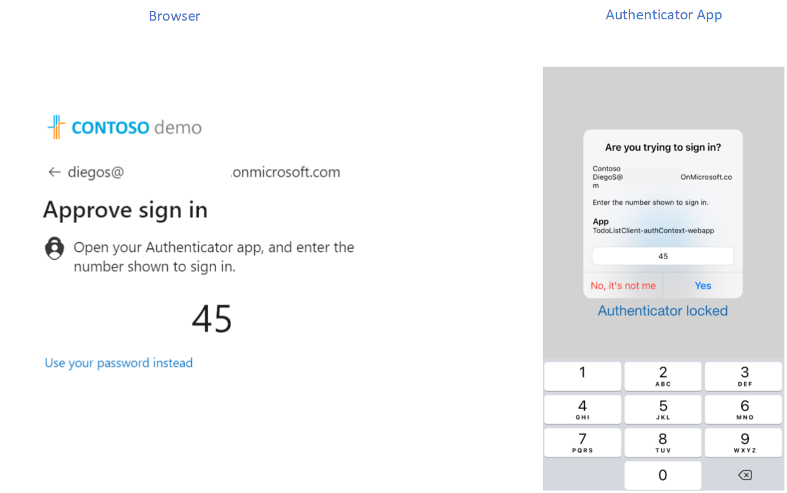

2. Once logged on to the TodoListClient application Click **TodoList** followed by **Create New** (To create a new item in the list) 

    

3. Fill in the ToDo item form and click **Create**

    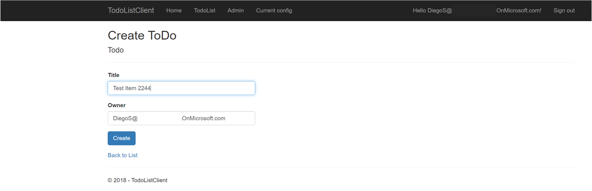

4. Since this operation requires the Conditional access Authentication context claim challenge C1 the corresponding CA rule will be executed by Azure AD 

    -  The user will be shown the **location** requirement window with **number match** screen on the Browser
    - In parallel the user will be **notified on the Microsoft Authenticator**

        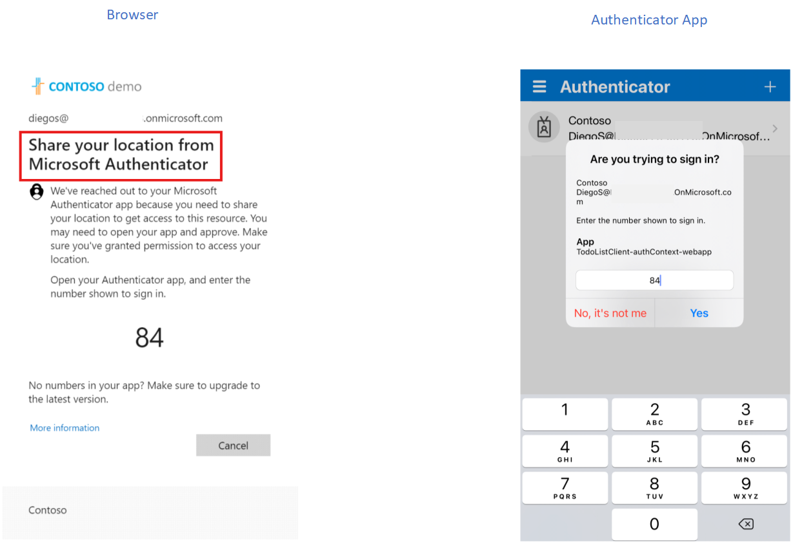

    - The user must enter the **matching number** as well as perform iOS (FaceID/TouchID) after which the **location information** (Country code) is sent by Microsoft Authenticator to Azure AD.
    - Azure AD issues a **new token** with appropriate Authentication Context claim **C1**
    - Call comes back to the **ToDoListClient application** with the **new token** enabling the POST operation to complete thereby successfully creating the **new ToDoList item**

5.	The final validation step is to attempt to delete an item from the TodoList. Click TodoList and choose an item to delete. This will load the Delete ToDo page with item displayed

    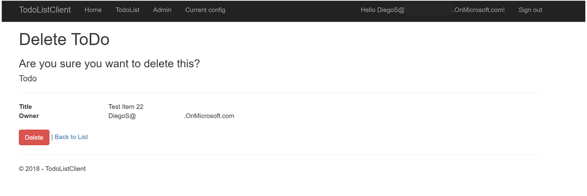

6. Click on the **Delete** button to confirm deletion.

    - Since our Test User is in Switzerland and we already have the location information based on the authentication context claim in the token from earlier step 4., the **Delete operation will not be allowed.** 
    - The following message will be displayed by the application

        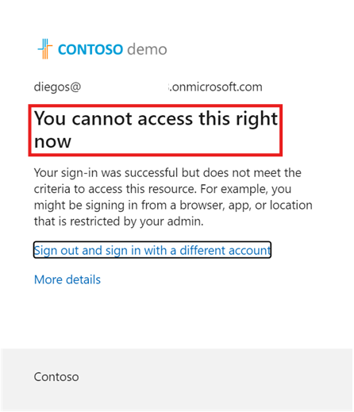

## Contributors
*This article is maintained by Microsoft. It was originally written by the following contributors.* 

Principal authors:
 - [Kunal Kodkani](https://www.linkedin.com/in/kunalkodkani) | Senior Program Manager - Cloud for Industry (FSI)
 - [Caleb Baker](https://www.linkedin.com/in/baker-caleb) | Principal Product Manager - Identity Engineering
 - [Paresh Nhathalal](https://www.linkedin.com/in/paresh-nhathalal-72613b2) | Senior Customer Engineering Manager - Identity Engineering

 
*To see non-public LinkedIn profiles, sign in to LinkedIn.*

